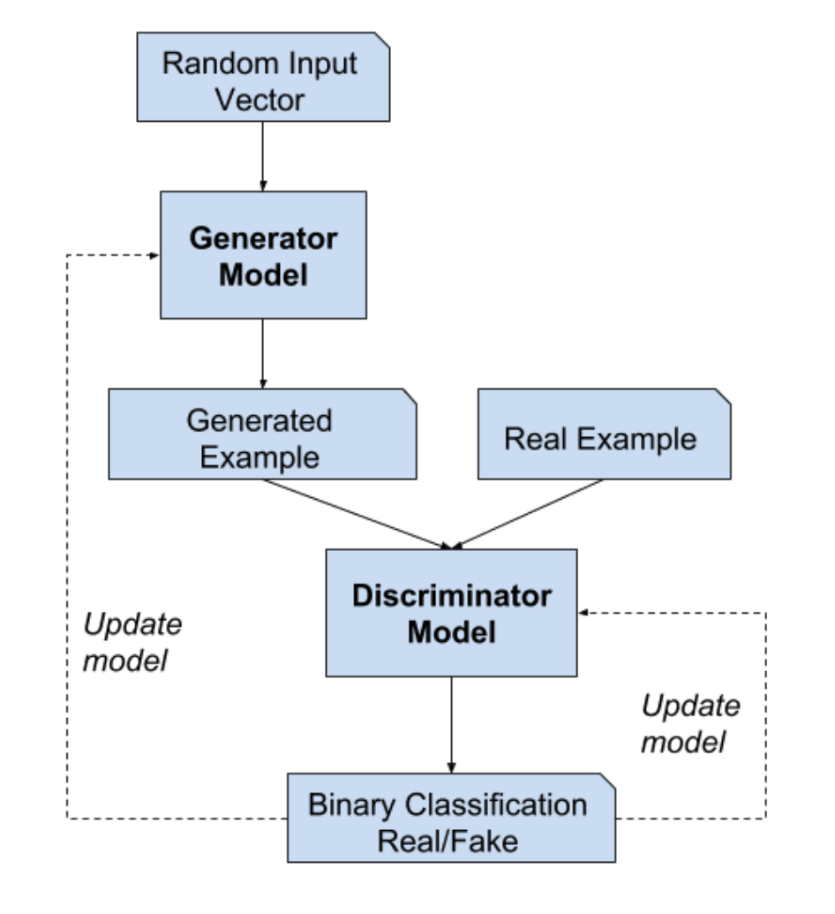
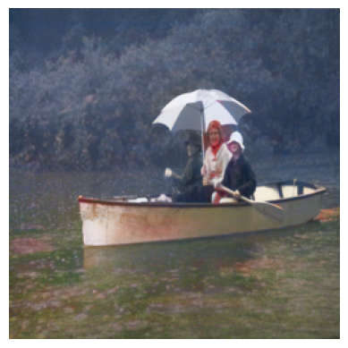
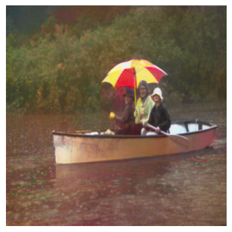
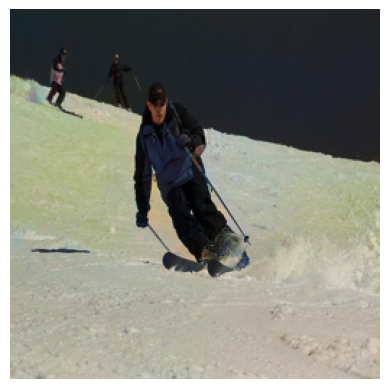
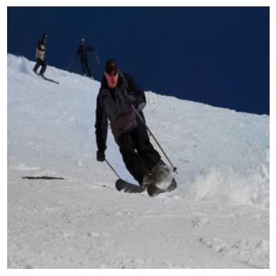

# Image Colourization using Conditional Generative Adversarial Neural Networks.

## Desciption -
### Problem Statement
Image colorization is the process of converting grayscale images to their colorful versions. In recent years, the majority of new papers researching image colorization use cGANs. cGANs condition the network on a grayscale input image and generate a color output image. In our project, we are also using cGANS.

The below image is a structure of cGAN model. In our case the input to the generator model is  grayscale images. we convert the color space from RGB to L\*a\*b. In L*a*b color space 3 numbers are associated with each pixel.



The first channel (L) shows the lightness of an image which when visualizing is a grayscale image and is the input to our generator model. The generator model then outputs the a and b channels, which hold information on how yellow-green and red-blue an image is. The generated example is the concatenation of the input (L channel) and output (a and b)channels. The Discriminator then classifies these images as fake or real, and based on its performance the discriminator and generator models’ weights will be updated.

### Solution Approach

We based our generator network on a Unet architecture. We go 8 layers down, since our original image size was 256, after down-sampling we end up with a 1x1 image, which we then up-sample with the same mapping. The discriminator is the patch discriminator model. Conv layers, Batch Norm and Leaky Relu were stacked in both networks. The generator also had drop-out.

We ran 3 experiments - 

1st one was the Baseline model. Here, we used the Unet without any additions or modifications to it. Just simple convolution layers stacked with batch norm, leaky relu and dropout. This model was trained with BCEwithLogits Loss. BCE with Logits Loss combines sigmoid layer and BCE loss into one single class. This makes the generative architecture more numerically stable.

Our 2nd experiment was adding a resnet backbone to the baseline unet. Adding a Resnet backbone allows us to extract better features. This was also trained using BCEwithLogits loss.

Our 3rd and final experiment replaced the BCE loss and instead added PSNR as a metric.

We also added L1 loss to the GAN criterion for the generator networks in each of these experiments to reduce the effect of producing grey or brown toned images.

```
Results\visualizations folder holds 2 images, one showcases the original dataset. And one image showing the sample inference output.
.
## Dependencies to be added. - 
1.  Torch (version '1.9.1+cu102') - 
   ```
 conda install pytorch==1.9.1 torchvision==0.10.1 torchaudio==0.9.1 cudatoolkit=10.2 -c pytorch 
    or 
 pip install torch==1.9.1+cu102 torchvision==0.10.1+cu102 torchaudio==0.9.0 -f https://download.pytorch.org/whl/torch_stable.html
```
2. Fastai (version 2.4) 
``` 
pip install fastai==2.4 
```
3. GPUtil (version 1.4.0)- 
```
pip install GPUtil 
```
4. sklearn (version 1.2.0)
``` 
pip install -U scikit-learn 
```
5. skimage (version 0.19.3)
```
pip install -U scikit-image
```
## Example commands for execution - 

### For training -
1. To run the baseline model (Unet with BCEwithLogitsLoss)- 
```
python main.py -- dataset <your_path_to_dataset> --cpt_dir <path_to_store_training_checkpoints> --vis_dir <path_to_store_visualizations> --op_dir <path_to_store_output_logs>  --BATCH_SIZE 16 --NUM_EPOCHS 20 --LEARNING_RATE 1e-4
```
2. To run the Unet model with a resnet18 backbone (Resnet-18 - Unet with BCEwithLogitsLoss) - 
```
python main.py --net resnet-18  -- dataset <your_path_to_dataset> --cpt_dir <path_to_store_training_checkpoints> --vis_dir <path_to_store_visualizations> --op_dir <path_to_store_output_logs>  --BATCH_SIZE 16 --NUM_EPOCHS 20 --LEARNING_RATE 1e-4
```
3. To run Unet model with a resnet18 backbone with PSNR loss - 
```
python main.py --net resnet-18 --dataset <your_path_to_dataset> --GAN_Mode PSNR --cpt_dir <path_to_store_training_checkpoints> --vis_dir <path_to_store_visualizations> --op_dir <path_to_store_output_logs> --BATCH_SIZE 8 --NUM_EPOCHS 20 --LEARNING_RATE 1e-4
```
4. To load models with weights from previous checkpoints
```
python main.py --net resnet-50 --dataset <your_path_to_dataset> --GAN_Mode PSNR --cpt_dir <path_to_store_training_checkpoints> --vis_dir <path_to_store_visualizations> --op_dir <path_to_store_output_logs> --BATCH_SIZE 16 --NUM_EPOCHS 20 --LEARNING_RATE 1e-4 --pPrev <path_to_GAN_weights> --path_net_g  <path_to_Resnet-18_weights>
```
5. Using the command line arguments,

   (i) ```--GAN_Mode``` controls the GAN criterion, can hold the following values - If \"vanilla\", criterion is BCEwithLogits, if \“lsgan\”, criterion is \"MSE\", if \”PSNR\”, criterion is \"PSNR\". Default is vanilla.

   (ii)``` --net``` controls the Generator network architecture, it should be either of baseline, resnet-18, vgg-16, inception. Default is baseline.
 
### For running the script for inference

```
python infer.py --net resnet-18 --pathNetG <path_to_the_weights_of_the_resnet18> --pathGAN <path_to_the_final_gan_model> --pathImg <path_to_test_image> --pathOP <path_to_output_directory>
```
link to access inference service deployed using kubernetes - http://02f39fe9-eu-de.lb.appdomain.cloud:8000/

## RESULTS

1. Baseline vs Res18-Unet (BCE with Logits Loss)
The resnet 18 - unet clearly works much better than baseline. With the baseline model we have much much lower colourization. This proves that adding a resnet 18 backbone to the unet does infact allow us to extract better feature maps.

 

2. Res18-Unet (BCE with Logits Loss) vs Res18-Unet(PSNR)
Peak Signal-to-Noise Ratio (PSNR),is computed between the generated colorized image and corresponding ground truth image. PSNR is closer to a human assessment of similarity. It can be computed as the log of inverse of MSE. A higher PSNR represents a higher reconstruction quality. At the end of training for 200 epochs, we got PSNR = 33.6 db. As per our analysis PSNR generated better results over BCELogitsLoss.

 

## Contributors
Anisha Bhatnagar (ab10945@nyu.edu)
Mina Pourostad (mp5737@nyu.edu)

## References
[1] Iizuka, S., Simo-Serra, E., & Ishikawa, H. (2016). Let there be color! Joint end-to-end learning of global and local image priors for automatic image colorization with simultaneous classification. ACM Transactions on Graphics (ToG), 35(4), 1-11.

[2] Treneska S, Zdravevski E, Pires IM, Lameski P, Gievska S. GAN-Based Image Colorization for Self-Supervised Visual Feature Learning. Sensors. 2022; 22(4):1599. https://doi.org/10.3390/s22041599

[3] Nazeri, Kamyar et al. “Image Colorization Using Generative Adversarial Networks.” AMDO (2018).

[4] Joshi, M.R.; Nkenyereye, L.; Joshi, G.P.; Islam, S.M.R.; Abdullah-Al-Wadud, M.; Shrestha, S. Auto-Colorization of Historical Images Using Deep Convolutional Neural Networks. Mathematics 2020, 8, 2258. https://doi.org/10.3390/math8122258

[5] Nazeri, Kamyar et al. “Image Colorization Using Generative Adversarial Networks.” AMDO (2018).

[6] Akanbi, Dele, Intro to Generative Adversarial Networks in PyTorch - https://medium.com/@oluarolu_96212/intro-to-generative-adversarial-networks-in-pytorch-f0a5a48b9d89 